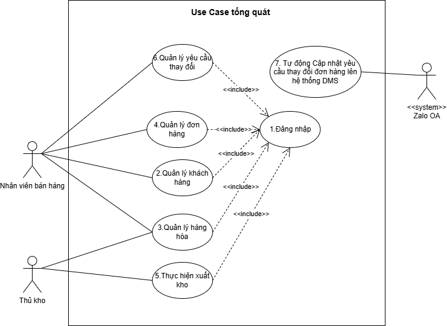
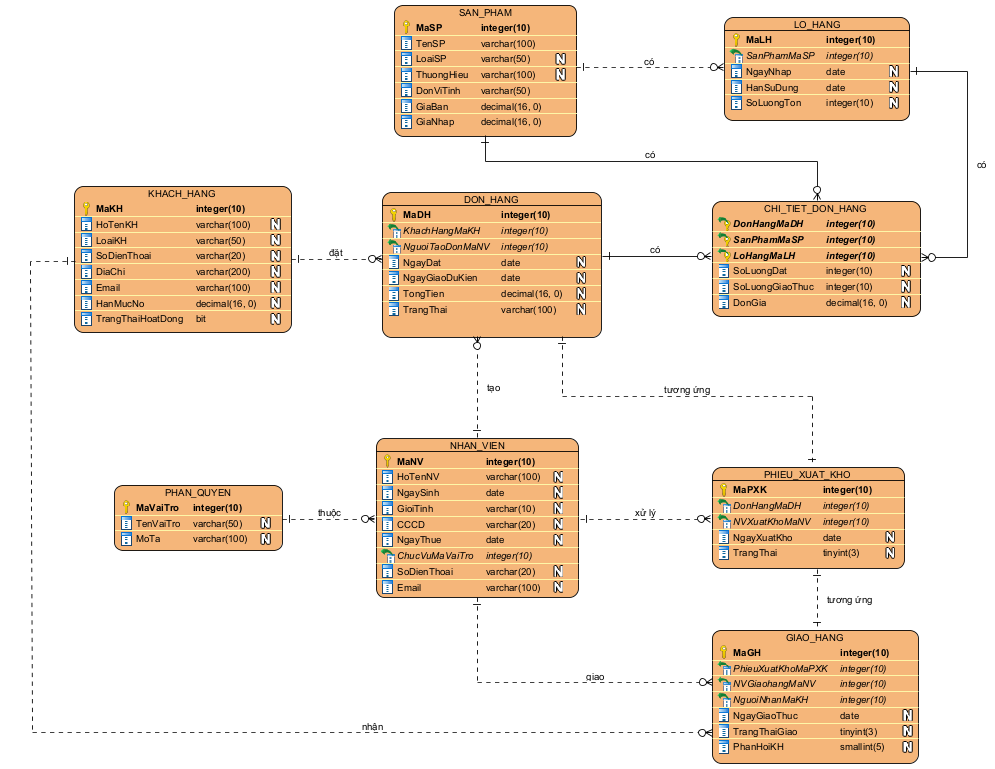

# 📦 Distribution Management System (DMS) – Business Analysis & System Design

> A Business Analysis case study focusing on optimizing the order fulfillment process for a distribution company through business process redesign, requirements engineering, and system analysis.

---

## 📌 Project Overview

This project presents a complete Business Analysis and System Design for a Distribution Management System (DMS) that addresses operational inefficiencies in the sales order fulfillment process.

The proposed solution digitizes and standardizes the workflow from order creation to delivery by integrating automatic credit checking, real-time inventory validation, FIFO-based warehouse picking, and customer confirmation via Zalo Official Account (Zalo OA).

Unlike a software implementation project, this repository focuses on **business analysis artifacts** rather than source code.

---

## 🎯 Business Problem

The existing distribution process relies heavily on manual operations and disconnected information across departments, resulting in several operational issues:

- Sales staff manually verify customer debt before confirming orders.
- Inventory availability is checked manually, causing delays and errors.
- Warehouse personnel select pallets based on personal experience instead of standardized rules.
- Customer order confirmation is performed manually via phone calls.
- Order status is difficult to track across Sales, Warehouse, Accounting, and Delivery departments.
- Decision-makers lack centralized operational reports.

These challenges reduce operational efficiency and increase the risk of incorrect deliveries, overdue receivables, and customer dissatisfaction.

---

## 🎯 Project Objectives

The project aims to redesign the current business process and propose a digital solution capable of:

- Standardizing the sales order management process.
- Automating customer credit validation.
- Providing real-time inventory availability checking.
- Supporting FIFO-based warehouse picking.
- Integrating customer confirmation through Zalo OA.
- Improving communication between departments.
- Increasing operational visibility through centralized information.

---

## 👥 Stakeholders

| Stakeholder | Responsibilities |
|-------------|------------------|
| Sales Staff | Create and manage customer orders |
| Accounting Staff | Manage customer information, debt, invoices |
| Warehouse Staff | Manage inventory and warehouse operations |
| Delivery Staff | Deliver goods and update delivery status |
| Management | Monitor business performance and operations |
| Customers | Confirm and receive orders |

---

# 📂 Repository Structure

```text
Distribution-Management-System/
│
├── README.md
│
├── Documents/
│   ├── Business Requirements Document.pdf
│   ├── System Analysis Report.pdf
│   └── Software Requirements Specification.pdf
│
├── Diagrams/
│   ├── BPMN/
│   ├── Use Case Diagram/
│   ├── Activity Diagram/
│   ├── Sequence Diagram/
│   ├── ERD/
│   └── Functional Decomposition/
│
└── Report/
```

---

# 🔍 Business Analysis Process

The project follows a standard Business Analysis workflow.

```text
Business Context
        │
        ▼
Problem Identification
        │
        ▼
Stakeholder Analysis
        │
        ▼
AS-IS Process Analysis
        │
        ▼
Root Cause Analysis
        │
        ▼
Business Rules
        │
        ▼
TO-BE Process Design
        │
        ▼
Requirements Engineering
        │
        ▼
System Analysis
```

---

# 📖 Business Analysis Artifacts

This repository contains the following BA deliverables.

| Artifact | Description |
|----------|-------------|
| Business Context | Business background and operational environment |
| Stakeholder Analysis | Stakeholder identification and analysis |
| AS-IS Process | Current business workflow |
| Pain Point Analysis | Existing operational issues |
| Root Cause Analysis | Analysis of underlying business problems |
| Business Rules Catalog | Business constraints and operational rules |
| TO-BE Process | Proposed future business workflow |
| Gap Analysis | Comparison between current and proposed processes |
| Functional Requirements | Functional requirements specification |
| Non-functional Requirements | Quality attributes and system constraints |
| Use Case Specifications | Detailed functional behaviors |
| UML Diagrams | Activity, Sequence, Class, ERD |

---

# ⭐ Key Business Features

## Automatic Customer Credit Validation

Before confirming an order, the system automatically validates customer credit limits and outstanding debt to reduce financial risk.

---

## Real-time Inventory Checking

Sales staff can immediately verify product availability while creating an order.

---

## FIFO Warehouse Recommendation

The system recommends warehouse pallets based on the First-In First-Out (FIFO) principle, reducing inventory aging and improving warehouse efficiency.

---

## Customer Confirmation via Zalo OA

Customers receive automatic order confirmation requests through Zalo Official Account before shipment.

---

## Warehouse Navigation

Warehouse operators receive pallet location guidance and picking suggestions through an integrated warehouse map.

---

## Order Tracking

Departments can monitor the entire order lifecycle from creation to delivery.

---

# 📊 Business Value

The proposed solution delivers several operational improvements.

| Current Process | Proposed Process |
|----------------|------------------|
| Manual debt verification | Automatic credit validation |
| Manual inventory checking | Real-time inventory availability |
| Experience-based warehouse picking | FIFO recommendation |
| Phone call confirmation | Zalo OA confirmation |
| Fragmented information | Centralized order tracking |
| Manual reporting | Automated reporting |

---

# 🛠 Techniques & Methodologies

### Business Analysis

- Business Process Analysis
- Stakeholder Analysis
- Requirement Elicitation
- Gap Analysis
- Root Cause Analysis
- Business Rule Analysis

### Modeling

- BPMN
- UML Use Case Diagram
- Activity Diagram
- Sequence Diagram
- Class Diagram
- Entity Relationship Diagram (ERD)

### Documentation

- Business Requirements Document (BRD)
- Software Requirements Specification (SRS)

---

# 📷 Project Artifacts

## Business Process


---

## Proposed Process


---

## Use Case Diagram



---

## Entity Relationship Diagram



---

# 💡 Key Analysis Decisions

During the analysis phase, several important business decisions were made:

- Introduced automatic credit validation before order confirmation.
- Standardized warehouse operations using FIFO recommendations.
- Integrated customer confirmation through Zalo OA.
- Centralized inventory visibility across departments.
- Reduced manual data entry using searchable customer and product catalogs.
- Improved traceability through audit logging and role-based access control.

---

# 🚀 Expected Benefits

The proposed solution is expected to:

- Reduce order processing time.
- Improve inventory accuracy.
- Minimize warehouse picking errors.
- Reduce overdue customer debt.
- Improve customer communication.
- Enhance cross-department collaboration.
- Increase operational transparency.

---

# 📚 Lessons Learned

This project strengthened practical Business Analysis skills in:

- Business Process Modeling
- Stakeholder Analysis
- Requirement Engineering
- Business Rule Definition
- UML Modeling
- Documentation Standards
- Solution Design

---

# 👤 Role

**Business Analyst**

### Responsibilities

- Business process analysis
- Stakeholder analysis
- Requirement elicitation
- Business rule definition
- Functional requirement specification
- UML modeling
- BPMN modeling
- System analysis
- Documentation

---

# 📄 License

This repository is intended for educational purposes and portfolio demonstration.
